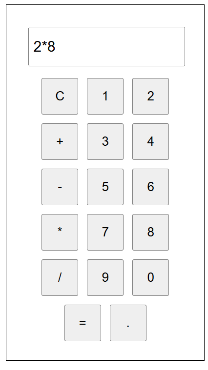

# 🧮 React JS Calculator (Vite)

A sleek and interactive **GUI-based calculator** built using **React.js** and **Vite**.
This project allows users to perform basic arithmetic operations with a modern and responsive interface.

---

## 🚀 Features

* 🧩 Intuitive graphical user interface
* ➕ Perform Addition, Subtraction, Multiplication, and Division
* 💡 Dynamic live display of inputs and results
* ♻️ Clear and reset functionality
* 🖱️ Fully button-based interaction
* ⚡ Fast performance powered by **Vite**
* 📱 Responsive design suitable for all screen sizes

---

## 🛠️ Tech Stack

| Technology            | Purpose                               |
| --------------------- | ------------------------------------- |
| **React.js (Vite)**   | Front-end library and fast build tool |
| **JavaScript (ES6+)** | Logic implementation                  |
| **CSS**               | Styling and layout                    |
| **Node.js + npm**     | Dependency management                 |

---

## ⚙️ Installation & Setup

Follow these steps to set up and run the project locally:

```bash
# Clone the repository
git clone https://github.com/yourusername/react-vite-calculator.git

# Navigate to the project directory
cd react-vite-calculator

# Install dependencies
npm install

# Start the development server
npm run dev
```

After running the command, open the provided local URL (e.g. **[http://localhost:5173/](http://localhost:5173/)**) in your browser.

---

## 🧰 Project Structure

```
react-vite-calculator/
│
├── src/
│   ├── components/
│   │   ├── Button.jsx
│   │   ├── Display.jsx
│   │   └── Calculator.jsx
│   ├── App.jsx
│   ├── App.css
│   └── main.jsx
│
├── public/
│   └── favicon.ico
│
├── package.json
└── vite.config.js
```

---

## 🧠 How It Works

* **Display Component** — Shows the entered number and calculation result
* **Button Component** — Handles user clicks for digits and operators
* **Calculator Component** — Manages state using React hooks (`useState`)
* The logic updates results dynamically and prevents invalid inputs

---

## 📸 Screenshots (Optional)

*Add an image once your calculator is ready!*

```
Example:


```

---


